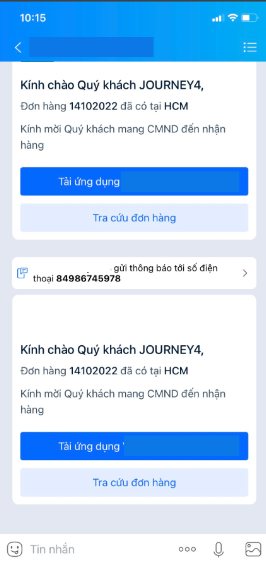

# Send Journey ZNS message

The endpoint is ideal for sending the message to the Zalo users.

To send the journey message to Zalo&#x20;

Below is the requirement that is required to send the journey message to Zalo.

* Register and authorize Zalo Official Account (Zalo OA).
* Register the journey message template.&#x20;

You can contact your sale man or contact us via Hotline 0901888484 to complete the requirement.\
\
Below is the journey message sample:

<figure><figcaption></figcaption></figure>

## HTTP request

<mark style="color:yellow;">**`POST`**</mark> [https://rest.esms.vn/MainService.svc/json/SendZaloMessage\_V4\_post\_json/](http://rest.esms.vn/MainService.svc/json/SendZaloMessage_V4_post_json/)

* **Content Type:** <mark style="color:orange;">application/json</mark>
* **Response Type:** <mark style="color:orange;">application/json</mark>

```json
curl --location 'https://rest.esms.vn//MainService.svc/json/SendZaloMessage_V4_post_json/' \
--header 'Content-Type: application/json' \
--data '{
    "ApiKey": "{{APIKEY}}",
    "SecretKey": "{{SecretKey}}",
    "Phone": "{{Phone}}",
    "Params": ["{{PARAM1}}","{{PARAM2}}","{{PARAM3}}"],
    "IsJourney": true,
    "OrderId": "{{ORDERID}}",
    "TempID": "{{TempID}}",
    "OAID": "{{OAID}}",
    "RequestId": "{{RequestId}}",
    "campaignid": "{{campaignid}}",
    "CallbackUrl":"{{CallbackUrl}}"
}'
```

* **Request body**

<table><thead><tr><th width="142">Tham số</th><th width="148">Kiểu dữ liệu </th><th width="141" data-type="checkbox">Tính bắt buộc</th><th>Mô tả</th></tr></thead><tbody><tr><td>ApiKey</td><td>string</td><td>true</td><td>Your API Key</td></tr><tr><td>SecretKey</td><td>string</td><td>true</td><td>Your SecretKey</td></tr><tr><td>Phone</td><td>string</td><td>true</td><td>The Zalo user's phone number.</td></tr><tr><td>Params</td><td>Array</td><td>true</td><td>The array values of parameters in your template.<br>Note:<br>1. The input value have to put in the same of its order in your template.<br>2. If it's duplicated, just place it once.</td></tr><tr><td>IsJourney</td><td>string</td><td>true</td><td>True: it's the journey message.<br>False: it's not the journey message. Normal ZNS message.</td></tr><tr><td>OrderId</td><td>string</td><td>true</td><td>Id of the journey, it is used for marking the journey and required if sending the journey message.</td></tr><tr><td>TempID</td><td>string</td><td>true</td><td>The template of Zalo OA that you  have registered at eSMS.<br>For ZNS journey message, you have to register the template at Zalo.</td></tr><tr><td>OAID </td><td>string</td><td>true</td><td><p>Zalo OA Id is the Zalo Official Account Id of the organization. It can be obtained by accessing to the Zalo administrator page.</p><p><strong>Note: Pre-registration is required.</strong></p></td></tr><tr><td>campaignid</td><td>string</td><td>false</td><td>The campaign name of request</td></tr><tr><td>RequestId</td><td>string</td><td>false</td><td>The identification value for the request to prevent the the request from duplicated.<br>Max length: 50</td></tr><tr><td>CallbackUrl</td><td>string</td><td>false</td><td><p>The webhook URL that will receive the status of message after it processed to the operator. It is used for determine whether the SMS is succcessfully delivered to the receiver or failed.</p><p><br>See the sample request at <a href="https://samplefordevelopers.esms.vn/#20f85e1f-3d9e-4ff4-bc4f-8d9c9edbc88a">here</a>.<br>More detail at <a href="../callback-url.md">here</a>.</p></td></tr><tr><td>Sandbox</td><td>string</td><td>false</td><td>Sandbox option value (<strong>default is 0</strong>):<br>1: For testing purpose to verify the validation of the request. Message is not charged and sent to the receiver.<br>0: Message will be processed to the receiver properly.</td></tr></tbody></table>

***

* **Response**:



```json
{
    "CodeResult": "100",
    "CountRegenerate": 0,
    "SMSID": "d8e0f1f0702544b2acb456ca9ccfd111250"
}
```

**Valid request.**



```json
{
    "CodeResult": "101",
    "CountRegenerate": 0,
    "ErrorMessage": "Authorize Failed"
}
```

**Invalid credential.**



* **Response body**

| Parameter    | Type   | Description                                  |
| ------------ | ------ | -------------------------------------------- |
| CodeResult   | string | Response code.                               |
| SMSID        | string | The message id eSMS system.                  |
| ErrorMessage | string | The error message if the request is invalid. |

* _<mark style="color:yellow;">**The detail of error code can refer at**</mark>_ [**Table of error codes**](../table-of-error-codes.md) **.**
* _<mark style="color:yellow;">**Get the  sample of code for programing languagues to use in Postman refer at**</mark>_ [**Link  of code samples**](https://samplefordevelopers.esms.vn/#850974b9-12cf-46f5-946c-e8e15aa3585b)**.**
